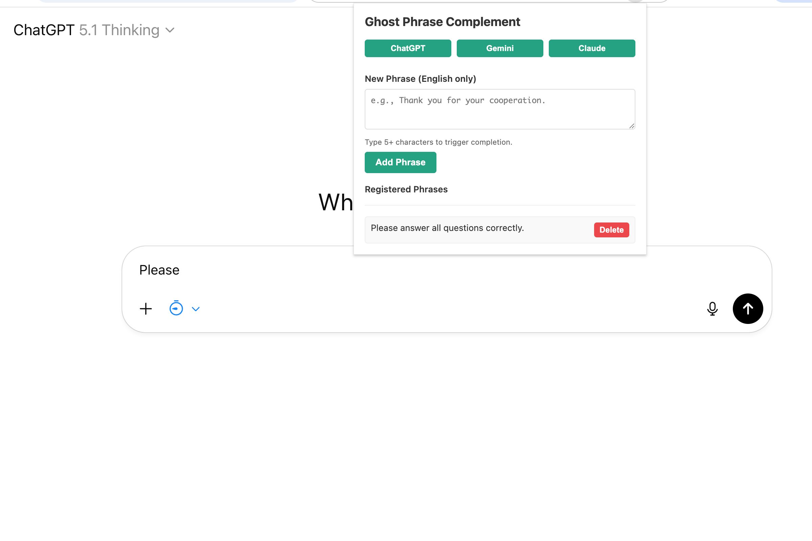
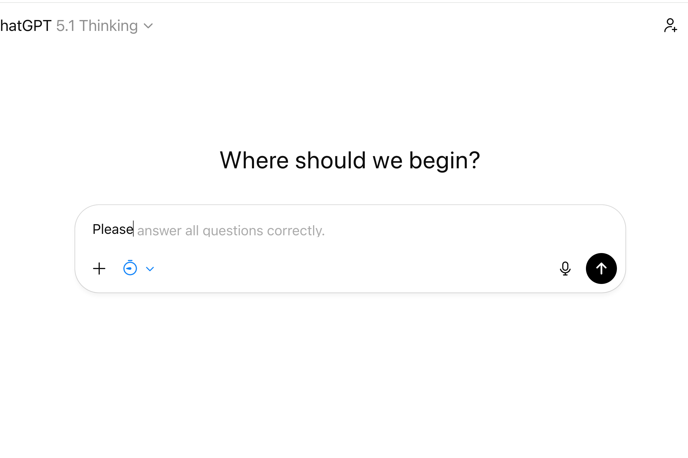
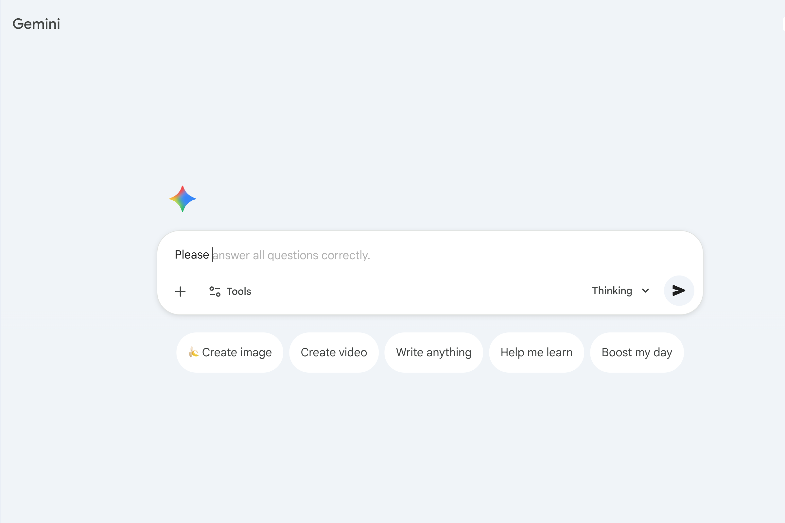
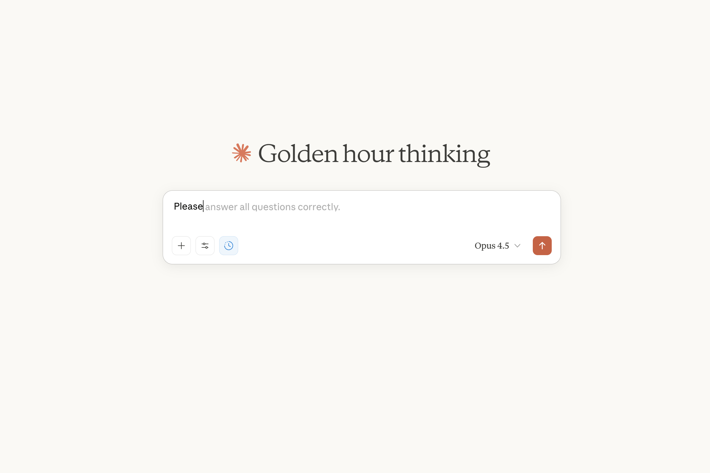

# Ghost Phrase Complement

[](./LICENSE)

<!-- Add other badges here if desired (CI Status / Version, etc.) -->
- Chrome Web Store: [Ghost Phrase Complement](https://chromewebstore.google.com/detail/ghost-phrase-complement/fihmaainokoaalkkcmllgnhcgkkiilpa?authuser=0&hl=en)

## Overview

Ghost Phrase Complement adds ghost-text completions for your own English-only phrases inside ChatGPT, Gemini, and Claude editors.

- Surfaces translucent suggestions once you type 5+ characters that match a saved phrase
- Lets you press Tab to accept the completion without breaking focus
- Stores everything locally with per-site toggles in the popup

This is an open-source extension implemented based on Chrome Extension Manifest v3.

---

## Features

- Inline ghost text overlay for textareas and contenteditable fields on ChatGPT, Gemini, and Claude; Tab inserts, Escape hides.
- Popup to add/delete up to 300 English-only phrases; sorted list with quick feedback.
- Per-site enable/disable toggles so you can turn the feature off for a given service without uninstalling.
- Scroll-synced ghost overlay that mirrors the active editor's styling to avoid layout jumps.
- Local-only storage via `chrome.storage.local`; no network calls or analytics.

---

## Screenshots

| Screen                                          | Description                               |
| ----------------------------------------------- | ----------------------------------------- |
|  | Popup settings interface (phrase manager) |
|  | ChatGPT ghost text suggestion in action   |
|  | Gemini ghost text suggestion in action    |
|  | Claude ghost text suggestion in action    |

---

## Installation

- Chrome Web Store: [Ghost Phrase Complement](https://chromewebstore.google.com/detail/ghost-phrase-complement/fihmaainokoaalkkcmllgnhcgkkiilpa?authuser=0&hl=en)

### 1. Clone the repository

```bash
git clone https://github.com/gakkunn/Ex-Chrome-ghost-complement.git
cd Ex-Chrome-ghost-complement
```

### 2. Install dependencies & Build

```bash
npm install
npm run build
```

### 3. Install to Chrome (Developer Mode)

1. Open Chrome
2. Go to `chrome://extensions/`
3. Toggle **"Developer mode"** on in the top right corner
4. Click **"Load unpacked"**
5. Select the `dist/` folder of this project

---

## Usage

1. Pin the Ghost Phrase Complement icon from the Chrome toolbar.
2. Open the popup to add your frequently used English-only phrases and toggle ChatGPT/Gemini/Claude on or off.
3. On a supported site, place your cursor in the chat input and type at least 5 English characters; a translucent ghost suggestion appears when a saved phrase matches.
4. Press **Tab** to accept the suggestion, or **Escape** to hide it; keep typing to dismiss naturally.
5. Manage or delete phrases anytime from the popup; changes take effect immediately.

---

## Development

### Prerequisites

- Node.js: >= 18.x
- npm

### Setup

```bash
git clone https://github.com/gakkunn/Ex-Chrome-ghost-complement.git
cd Ex-Chrome-ghost-complement

npm install
npm run watch   # Build in watch mode during development
# or for a one-time production build
npm run build
```

### Additional scripts

- `npm run lint` / `npm run lint:fix` - ESLint
- `npm run format` / `npm run format:check` - Prettier formatting
- `npm run typecheck` - TypeScript type checking
- `npm run check` - Run linting and format check together

---

## Project Structure

```text
Ex-Chrome-ghost-complement/
  src/                # Extension source (content scripts, popup UI, styles, types, utils)
    content-scripts/
    popup/
    styles/
    types/
    utils/
  public/             # Manifest v3, popup HTML, icons (source assets)
  dist/               # Build artifacts loaded into Chrome
  scripts/            # Build script (esbuild)
  docs/               # Documentation assets (screenshots)
  README.md
  PRIVACY_POLICY.md
  LICENSE
  package.json
```

---

## Contributing

Bug reports, feature suggestions, and pull requests are welcome.

Please refer to [CONTRIBUTING.md](./CONTRIBUTING.md) for detailed guidelines.

Quick steps:

1. Check Issues; create a new one if it doesn't exist
2. Fork the repository
3. Create a branch (e.g., `feat/xxx`, `fix/yyy`)
4. Commit changes and push
5. Create a Pull Request

---

## Privacy Policy

This extension keeps your phrase library and site preferences in local Chrome storage and does not send browsing data to external servers. For details, please see our [Privacy Policy](./PRIVACY_POLICY.md).

---

## License

This project is released under the [MIT License](./LICENSE).
